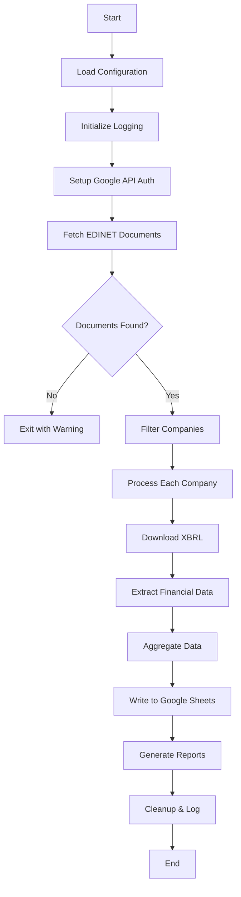

# Processing Flow | 処理フロー

## 🇯🇵 日本語

### 処理の全体的な流れ

EDINET Data Getterの処理は以下のような流れで実行されます：

#### 1. 初期化とセットアップ 🔧
- 環境変数の読み込み（`.env`ファイルから）
- ログシステムの初期化
- Google API認証の設定
- 必要なフォルダの作成

#### 2. EDINET APIからの書類一覧取得 📋
```
指定日付の書類 → EDINET API → JSON形式の書類リスト
```
- 指定した日付（`start_date`）の提出書類をEDINET APIから取得
- 有価証券報告書やXBRLファイルが含まれる書類を特定
- 企業情報（会社名、EDINETコード、証券コードなど）を取得

#### 3. 企業フィルタリング 🔍
```
全書類リスト → フィルタリング → 処理対象企業リスト
```
- ファンド系企業の除外（投資信託などをスキップ）
- 指定された企業数まで絞り込み
- スキップワードリストとの照合

#### 4. XBRLファイルの処理 📁
各企業に対して以下を実行：

```
XBRL URL → ダウンロード → ZIP解凍 → XMLファイル抽出
```

##### 4.1 ダウンロード
- XBRLファイルのダウンロードURL取得
- ZIPファイルとしてダウンロード
- `xbrl_files/`フォルダに保存

##### 4.2 解凍と抽出
- ZIPファイルを解凍
- 中のXMLファイル（XBRL形式）を特定
- 財務データが含まれるファイルを選択

#### 5. 財務データの抽出 💰
```
XBRLファイル → パース → 財務指標抽出 → データ辞書作成
```

抽出される主要指標：
- **配当性向** (Dividend Payout Ratio)
- **EPS** (Earnings Per Share)
- **株価収益率** (Price-to-Earnings Ratio)
- **営業CF** (Operating Cash Flow)
- **営業利益率** (Operating Profit Margin)
- **配当利回り** (Dividend Yield)
- **自己資本比率** (Equity Ratio)

#### 6. データの集約と整理 📊
```
各企業のデータ → 統合 → 最終データセット
```
- 抽出された財務データをリスト形式で統合
- 企業情報と財務指標の紐付け
- 欠損データのハンドリング

#### 7. Googleスプレッドシートへの書き込み 📝
```
最終データセット → Google Sheets API → スプレッドシート更新
```
- 認証されたGoogle Sheets APIを使用
- 指定されたスプレッドシートに新しい行を追加
- データの書式設定を適用

#### 8. ドキュメント生成 📄
```
処理結果 → マークダウン生成 → レポートファイル保存
```
- 処理サマリーの生成（`run_summary_YYYYMMDD_HHMMSS.md`）
- 設定ドキュメントの更新
- `md/`フォルダに保存

#### 9. ログとクリーンアップ 🧹
- 処理完了のログ出力
- 一時ファイルのクリーンアップ
- エラーハンドリングと例外処理

### エラーハンドリング ⚠️

各ステップでエラーが発生した場合：
- ログファイルに詳細なエラー情報を記録
- 可能な場合は処理を継続
- 致命的なエラーの場合は適切にプログラムを終了

---

## 🇺🇸 English

### Overall Processing Flow

The EDINET Data Getter executes the following processing flow:

#### 1. Initialization and Setup 🔧
- Load environment variables (from `.env` file)
- Initialize logging system
- Set up Google API authentication
- Create necessary folders

#### 2. Document List Retrieval from EDINET API 📋
```
Documents by date → EDINET API → JSON document list
```
- Fetch submitted documents for specified date (`start_date`) from EDINET API
- Identify documents containing securities reports and XBRL files
- Retrieve company information (company name, EDINET code, security code, etc.)

#### 3. Company Filtering 🔍
```
All documents → Filtering → Target company list
```
- Exclude fund-related companies (skip investment trusts, etc.)
- Narrow down to specified number of companies
- Cross-reference with skip word list

#### 4. XBRL File Processing 📁
Execute the following for each company:

```
XBRL URL → Download → ZIP extraction → XML file extraction
```

##### 4.1 Download
- Retrieve XBRL file download URL
- Download as ZIP file
- Save to `xbrl_files/` folder

##### 4.2 Extraction and Processing
- Extract ZIP file
- Identify XML files (XBRL format) inside
- Select files containing financial data

#### 5. Financial Data Extraction 💰
```
XBRL file → Parse → Extract financial metrics → Create data dictionary
```

Main extracted metrics:
- **Dividend Payout Ratio** (配当性向)
- **EPS** - Earnings Per Share
- **P/E Ratio** - Price-to-Earnings Ratio
- **Operating CF** - Operating Cash Flow
- **Operating Profit Margin** (営業利益率)
- **Dividend Yield** (配当利回り)
- **Equity Ratio** (自己資本比率)

#### 6. Data Aggregation and Organization 📊
```
Each company's data → Integration → Final dataset
```
- Integrate extracted financial data in list format
- Link company information with financial metrics
- Handle missing data

#### 7. Google Spreadsheet Writing 📝
```
Final dataset → Google Sheets API → Spreadsheet update
```
- Use authenticated Google Sheets API
- Add new rows to specified spreadsheet
- Apply data formatting

#### 8. Document Generation 📄
```
Processing results → Markdown generation → Save report files
```
- Generate processing summary (`run_summary_YYYYMMDD_HHMMSS.md`)
- Update configuration documentation
- Save to `md/` folder

#### 9. Logging and Cleanup 🧹
- Output processing completion logs
- Clean up temporary files
- Error handling and exception processing

### Error Handling ⚠️

When errors occur at each step:
- Record detailed error information in log files
- Continue processing when possible
- Properly terminate program for fatal errors

## 🔄 Detailed Flow Diagram



## 📊 Data Flow

```
Raw EDINET Data → XBRL Files → Parsed Financial Metrics → Google Sheets → Reports
```

Each step ensures data integrity and provides comprehensive logging for troubleshooting and monitoring.